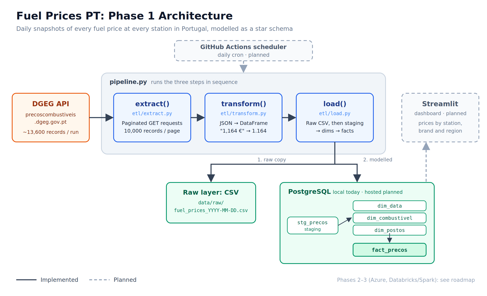
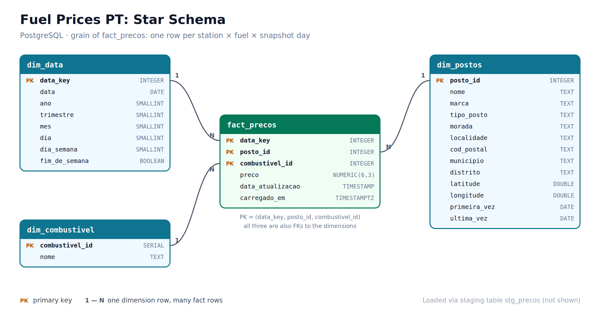
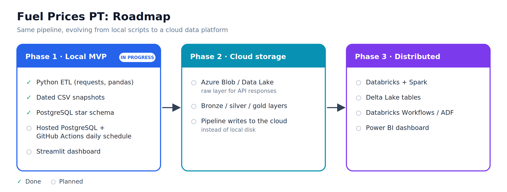

# Fuel Prices PT

A daily ETL pipeline that collects the price of every fuel at every petrol station in Portugal and models it as a star schema in PostgreSQL, building a price history that the official source does not keep.



## Why this project

Portugal's Directorate-General for Energy and Geology (DGEG) publishes current fuel prices for every station in the country at [precoscombustiveis.dgeg.gov.pt](https://precoscombustiveis.dgeg.gov.pt). It only shows the **current** price: when a station updates, the previous value is gone.

This pipeline takes a snapshot every day and stores it, turning a "right now" view into a historical dataset. That makes it possible to answer questions the source can't, such as how prices evolve by brand, region or station over time.

I built it as a portfolio project while moving from mechanical engineering into data engineering, to practise the full lifecycle of a pipeline: data discovery, extraction, transformation, storage, modelling, scheduling and visualisation.

## Data source

The DGEG website has no documented public API. I found the endpoint the site uses internally by inspecting its network traffic in the browser's DevTools:

```
GET https://precoscombustiveis.dgeg.gov.pt/api/PrecoComb/PesquisarPostos
```

Key findings (full details in [`notes/api-discovery.md`](notes/api-discovery.md)):

- Each record is one **(station, fuel type)** pair, so a station selling 4 fuels appears 4 times, with its details repeated.
- The `Quantidade` field holds the **total number of records** for the query (repeated on every row), which is what drives pagination.
- The API accepts up to 10,000 records per page, so a full national extraction takes **2 requests** (~13,600–14,100 records, varying day to day).
- Prices arrive as Portuguese-formatted text (`"1,164 €"`) and need parsing.

The data belongs to DGEG. Their terms allow personal, non-commercial use; this project is a non-commercial learning exercise and keeps request volume minimal (one run per day, with a pause between pages).

## How it works

The pipeline follows an **extract → transform → load** structure, with each step in its own module:

| Step | File | What it does |
|---|---|---|
| Extract | [`etl/extract.py`](etl/extract.py) | Paginated requests to the DGEG API until every record is collected |
| Transform | [`etl/transform.py`](etl/transform.py) | Converts the JSON records into a pandas DataFrame and parses prices into numbers |
| Load | [`etl/load.py`](etl/load.py) | Saves a dated raw CSV, then loads PostgreSQL through a staging table |
| Orchestration | [`pipeline.py`](pipeline.py) | Runs the three steps in sequence |

The load step writes to two layers:

1. **Raw layer:** a dated CSV per run in `data/raw/`, exactly as transformed. If the database ever needs rebuilding, it can be reloaded from these files.
2. **Modelled layer:** the day's rows are bulk-copied (`COPY`) into a staging table, then [`sql/load_from_staging.sql`](sql/load_from_staging.sql) moves them into the dimensions first and the fact table second.

Example run:

```
Page 1: 10000 records (accumulated: 10000 / 13627)
Page 2: 3627 records (accumulated: 13627 / 13627)
Extract complete: 13627 records

Transform complete: 13627 rows, 16 columns

Saved 13627 rows to data/raw/fuel_prices_2026-10-04.csv
Staged 13627 rows in stg_precos
Loaded PostgreSQL: 13627 price rows for 2026-10-04
Pipeline finished.
```

## Data model



A **star schema** in PostgreSQL, defined in [`sql/schema.sql`](sql/schema.sql):

| Table | One row = | Key |
|---|---|---|
| `fact_precos` | one station × fuel × snapshot day | (`data_key`, `posto_id`, `combustivel_id`) |
| `dim_postos` | one station | DGEG station `Id` |
| `dim_combustivel` | one fuel type | generated ID |
| `dim_data` | one calendar day | integer date, e.g. `20261004` |

`fact_precos` is a **periodic snapshot fact table**: every station's price is recorded every day, even when it hasn't changed, so "what was the price on day X?" is a simple lookup.

### Design decisions

- **Idempotent loads.** The fact table's primary key is (day, station, fuel), and inserts use `ON CONFLICT DO NOTHING`. Rerunning the pipeline on the same day never creates duplicates.
- **One transaction per run.** Staging, dimensions and facts load together: if any step fails, nothing from that run is kept.
- **Dimensions before facts.** Foreign keys guarantee every price points to an existing station, fuel and date.
- **Two dates per price.** `data_key` is when the pipeline captured the price; `data_atualizacao` is when the station last changed it. An old `data_atualizacao` flags a possibly stale price.
- **Exact prices.** Prices are `NUMERIC(6,3)`, not floating point, so values are stored exactly.
- **Station changes overwrite (SCD Type 1).** `dim_postos` keeps the latest details of each station, plus `primeira_vez` / `ultima_vez`, the first and latest day it appeared. A station whose `ultima_vez` stops advancing has probably closed.
- **Append-only raw layer.** Each run adds a new dated CSV and never edits old ones.

### Example query

Average simple diesel price per district, on the latest day loaded:

```sql
SELECT p.distrito,
       ROUND(AVG(f.preco), 3) AS preco_medio,
       COUNT(*)               AS postos
FROM fact_precos f
JOIN dim_postos      p USING (posto_id)
JOIN dim_combustivel c USING (combustivel_id)
WHERE c.nome = 'Gasóleo simples'
  AND f.data_key = (SELECT MAX(data_key) FROM fact_precos)
GROUP BY p.distrito
ORDER BY preco_medio;
```

## Roadmap



**Phase 1: Local MVP** *(in progress)*
- [x] Discover and document the DGEG API
- [x] Modular ETL in Python (requests, pandas)
- [x] Daily, dated CSV snapshots
- [x] PostgreSQL star schema with idempotent loads
- [ ] Hosted PostgreSQL + daily scheduling with GitHub Actions
- [ ] Streamlit dashboard

**Phase 2: Cloud storage**
- [ ] Raw layer in Azure Blob Storage / Data Lake
- [ ] Bronze / silver / gold layers

**Phase 3: Distributed processing**
- [ ] Databricks + Spark transformations
- [ ] Delta Lake tables
- [ ] Orchestration with Databricks Workflows or Azure Data Factory
- [ ] Power BI dashboard

## Project structure

```
├── etl/
│   ├── extract.py              # API requests and pagination
│   ├── transform.py            # cleaning and parsing
│   └── load.py                 # raw CSV + PostgreSQL load
├── sql/
│   ├── schema.sql              # star schema: tables, keys, constraints
│   └── load_from_staging.sql   # staging → dimensions → fact table
├── pipeline.py                 # runs the full ETL
├── backfill.py                 # loads existing raw CSVs into PostgreSQL
├── notebooks/                  # initial API exploration
├── notes/                      # API discovery notes and work logs
├── docs/images/                # diagrams
├── .env.example                # template for database settings
└── requirements.txt
```

The `data/` folder is created when the pipeline runs and is excluded from version control, as is `.env`.

## How to run

Requires Python 3.14 (the version it was built and tested with) and PostgreSQL (tested with 18).

**1. Get the code and install dependencies**

```bash
git clone https://github.com/amffpsa24-art/DE-Project---fuel-prices-pt.git
cd DE-Project---fuel-prices-pt

python -m venv .venv
# Windows (PowerShell)
.venv\Scripts\Activate.ps1
# macOS / Linux
source .venv/bin/activate

pip install -r requirements.txt
```

**2. Set up the database**

```bash
psql -U postgres -c "CREATE DATABASE fuel_prices ENCODING 'UTF8';"
psql -U postgres -d fuel_prices -f sql/schema.sql
```

Copy `.env.example` to `.env` and fill in your PostgreSQL password.

**3. Run**

```bash
python pipeline.py    # today's snapshot: raw CSV + database
python backfill.py    # optional: load any older CSVs from data/raw/
```

Both are safe to rerun: rows that already exist are skipped.

## Tech stack

**Now:** Python, requests, pandas, PostgreSQL, psycopg, SQL, Git/GitHub
**Planned:** hosted PostgreSQL, GitHub Actions, Streamlit, Azure, Databricks, Spark, Delta Lake

## Author

**André Francisco**: mechanical engineer (MSc, Instituto Superior Técnico) moving into data engineering.
[LinkedIn](https://www.linkedin.com/in/your-profile)
