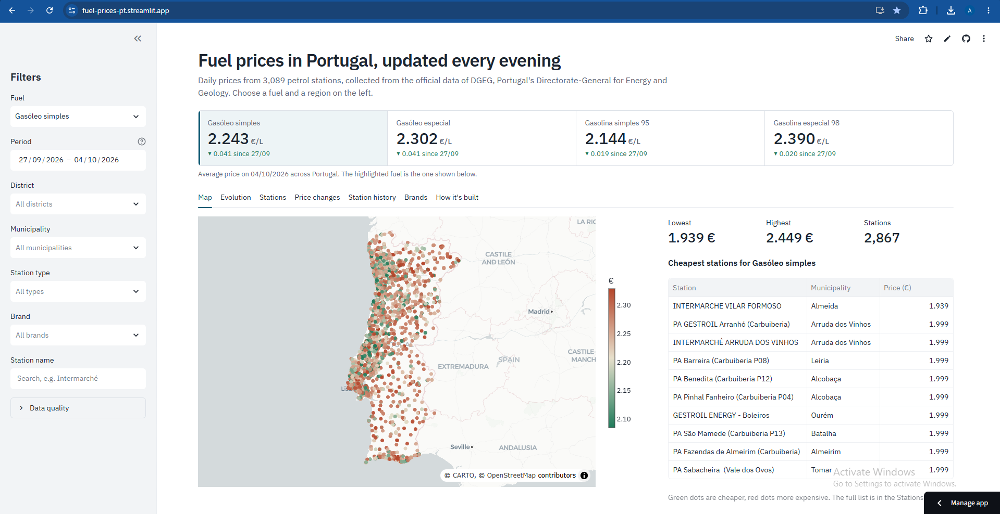
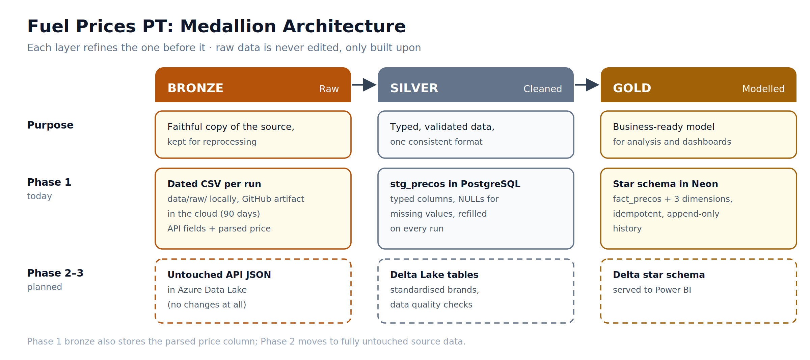

# Fuel Prices PT

[](https://fuel-prices-pt.streamlit.app/) 


[](https://github.com/amffpsa24-art/DE-Project---fuel-prices-pt/actions/workflows/ci.yml)

**Live dashboard: [fuel-prices-pt.streamlit.app](https://fuel-prices-pt.streamlit.app/)**

A daily ETL pipeline that collects the price of every fuel at every petrol station in Portugal and models it as a star schema in a hosted PostgreSQL database, building a price history that the official source does not keep. It runs automatically every day on GitHub Actions, and a public Streamlit dashboard reads the warehouse.


## Why this project

Portugal's Directorate-General for Energy and Geology (DGEG) publishes current fuel prices for every station in the country at [precoscombustiveis.dgeg.gov.pt](https://precoscombustiveis.dgeg.gov.pt). It only shows the **current** price: when a station updates, the previous value is gone.

This pipeline takes a snapshot every day and stores it, turning a "right now" view into a historical dataset. That makes it possible to answer questions the source can't, such as how prices evolve by brand, region or station over time.

I built it as a portfolio project while moving from mechanical engineering into data engineering, to practise the full lifecycle of a pipeline: data discovery, extraction, transformation, storage, modelling, scheduling and visualisation.

## Data source

The DGEG website has no documented public API. I found the endpoint the site uses internally by inspecting its network traffic in the browser's DevTools:

```
GET https://precoscombustiveis.dgeg.gov.pt/api/PrecoComb/PesquisarPostos
```

Key findings (full details in [`notes/api-discovery.md`](notes/api-discovery.md)):

- Each record is one **(station, fuel type)** pair, so a station selling 4 fuels appears 4 times, with its details repeated.
- The `Quantidade` field holds the **total number of records** for the query (repeated on every row), which is what drives pagination.
- The API accepts up to 10,000 records per page, so a full national extraction takes **2 requests** (~13,600–14,100 records, varying day to day).
- Prices arrive as Portuguese-formatted text (`"1,164 €"`) and need parsing.

The data belongs to DGEG. Their terms allow personal, non-commercial use; this project is a non-commercial learning exercise and keeps request volume minimal (one run per day, with a pause between pages).

## How it works

The pipeline follows an **extract → transform → load** structure, with each step in its own module:

| Step | File | What it does |
|---|---|---|
| Extract | [`etl/extract.py`](etl/extract.py) | Paginated requests to the DGEG API until every record is collected |
| Transform | [`etl/transform.py`](etl/transform.py) | Converts the JSON records into a pandas DataFrame and parses prices into numbers |
| Load | [`etl/load.py`](etl/load.py) | Saves a dated raw CSV, then loads PostgreSQL through a staging table |
| Orchestration | [`pipeline.py`](pipeline.py) | Runs the three steps in sequence |
| Scheduling | [`.github/workflows/daily.yml`](.github/workflows/daily.yml) | Runs the pipeline every day on GitHub Actions |
| Dashboard | [`dashboard/app.py`](dashboard/app.py) | Public Streamlit app reading the warehouse, hosted on Streamlit Community Cloud |

Example run:

```
Page 1: 10000 records (accumulated: 10000 / 13627)
Page 2: 3627 records (accumulated: 13627 / 13627)
Extract complete: 13627 records

Transform complete: 13627 rows, 16 columns

Saved 13627 rows to data/raw/fuel_prices_2026-10-04.csv
Staged 13627 rows in stg_precos
Loaded PostgreSQL: 13627 price rows for 2026-10-04
Pipeline finished.
```

## Medallion architecture



The data moves through three layers, following the **medallion** pattern. Each layer builds on the previous one, and the raw layer is never edited:

| Layer | Purpose | Phase 1 (today) |
|---|---|---|
| **Bronze** | Faithful copy of the source, kept for reprocessing | A dated CSV per run: `data/raw/` locally, a GitHub Actions artifact in the cloud |
| **Silver** | Cleaned, typed data in one consistent format | `stg_precos`: typed staging table in PostgreSQL, refilled on every run |
| **Gold** | Business-ready model for analysis | The star schema in Neon: `fact_precos` and three dimensions |

If the gold layer ever needs rebuilding, it can be reloaded from bronze with [`backfill.py`](backfill.py).

Phase 1 is a lightweight version of the pattern: the bronze CSV already includes the parsed price column next to the original text, and the silver layer is a staging table rather than a stored history. Phase 2 makes the layers explicit in Azure, with untouched API responses in bronze and cleaned Delta Lake tables in silver.

## Automation

The pipeline runs every day on **GitHub Actions** ([`daily.yml`](.github/workflows/daily.yml)) and writes to a **hosted PostgreSQL database on [Neon](https://neon.com)**, so it runs without any local machine switched on.

- **Schedule:** every day at 19:17 UTC, in the evening so most stations have published the day's prices. It can also be started manually from the Actions tab.
- **Credentials:** the database connection comes from **GitHub Secrets**, exposed to the job as environment variables. No password is stored in the code or the repository.
- **Raw snapshots:** GitHub's machines are wiped after each run, so the day's CSV is uploaded as a **workflow artifact**, kept for 90 days. The upload runs even if the database step fails, so the raw data is never lost to a load error.
- **Correct dates:** the job runs with the `Europe/Lisbon` time zone, so each snapshot gets the Portuguese date.
- **Safe reruns:** because loads are idempotent, a retried or manual run on the same day never duplicates data.

## Dashboard

The [live dashboard](https://fuel-prices-pt.streamlit.app/) shows today's average prices on a price board, then lets anyone explore the data by fuel, period, district, municipality, station type, brand or station name:

- **Map** of every station, coloured from cheapest to most expensive, with the 10 cheapest alongside
- **Evolution** of average prices over time, by district or comparing several fuels
- **Stations**: the full filtered list, downloadable as CSV
- **Price changes**: which stations raised or cut prices since the previous snapshot
- **Station history**: one station's prices over time, plus every version of its details (SCD Type 2)
- **Brands**: average price per brand
- **How it's built**: the pipeline behind the data

How it connects to the warehouse:

- **Read-only access.** The app uses its own database user, [`dashboard_reader`](sql/dashboard_role.sql), which can only `SELECT` from the view and the dimensions. Its credentials live in Streamlit Cloud's secrets, never in the repository.
- **One view as the interface.** The app reads [`vw_precos`](sql/views.sql), the star schema joined into one table, plus a `dias_desde_atualizacao` column used to leave out stale prices.
- **Filtering in SQL.** Every filter becomes a parameterised `WHERE` clause, and history is aggregated in the database, so only the rows needed reach the app.
- **Caching.** Query results are cached for an hour: the data changes once a day, so most visits don't touch the database at all.
- **Honest charts.** Days without a snapshot are drawn as dotted segments, and price changes are always compared with the previous snapshot actually available.

## Data model


A **star schema** in PostgreSQL, defined in [`sql/schema.sql`](sql/schema.sql):

| Table | One row = | Key |
|---|---|---|
| `fact_precos` | one station × fuel × snapshot day | (`data_key`, `posto_sk`, `combustivel_id`) |
| `dim_postos` | one **version** of a station (SCD Type 2) | generated `posto_sk`; DGEG's `Id` kept as `posto_id` |
| `dim_combustivel` | one fuel type | generated ID |
| `dim_data` | one calendar day | integer date, e.g. `20261004` |

`fact_precos` is a **periodic snapshot fact table**: every station's price is recorded every day, even when it hasn't changed, so "what was the price on day X?" is a simple lookup.

The day's rows are bulk-copied (`COPY`) into the staging table, then [`sql/load_from_staging.sql`](sql/load_from_staging.sql) loads the dimensions first and the fact table second.

### Station history: SCD Type 2

Stations change: a GALP becomes a PRIO, a station is renamed or moves. `dim_postos` is a **slowly changing dimension (Type 2)**: instead of overwriting a station's details, it closes the old row and adds a new **version**, so every price keeps the details that were true on its day.

| posto_sk | posto_id | marca | valido_de | valido_ate | atual |
|---|---|---|---|---|---|
| 1 | 94625 | GALP | 2026-09-27 | 2026-10-03 | false |
| 3 | 94625 | PRIO | 2026-10-04 | 9999-12-31 | true |

*(illustrative example)*

- **Surrogate and natural keys.** `posto_sk` is generated, one per version, and is what the fact table points to. `posto_id` is DGEG's own station `Id`, shared by all versions of a station.
- **Change detection.** Each run compares the incoming details with the current version, column by column, using `IS DISTINCT FROM` so that missing values (NULL) compare as equal instead of triggering false changes.
- **Point-in-time lookup.** Each price is linked to the version valid on its snapshot day: `snapshot_date BETWEEN valido_de AND valido_ate`.
- **Enforced in the database.** A partial unique index allows at most one current version (`atual`) per station.
- **Known limits.** Snapshots must be loaded in date order (daily runs are; `backfill.py` sorts its files), and a change is dated to the first snapshot that shows it, so precision is one day.

### Design decisions

- **Idempotent loads.** The fact table's primary key is (day, station, fuel), and inserts use `ON CONFLICT DO NOTHING`. Rerunning the pipeline on the same day never creates duplicates.
- **One transaction per run.** Staging, dimensions and facts load together: if any step fails, nothing from that run is kept.
- **Dimensions before facts.** Foreign keys guarantee every price points to an existing station, fuel and date.
- **Two dates per price.** `data_key` is when the pipeline captured the price; `data_atualizacao` is when the station last changed it. An old `data_atualizacao` flags a possibly stale price.
- **Exact prices.** Prices are `NUMERIC(6,3)`, not floating point, so values are stored exactly.
- **Append-only bronze layer.** Each run adds a new dated CSV and never edits old ones.

### Example query

Average simple diesel price per district, on the latest day loaded, written against the star schema:

```sql
SELECT p.distrito,
       ROUND(AVG(f.preco), 3) AS preco_medio,
       COUNT(*)               AS postos
FROM fact_precos f
JOIN dim_postos      p USING (posto_sk)
JOIN dim_combustivel c USING (combustivel_id)
WHERE c.nome = 'Gasóleo simples'
  AND f.data_key = (SELECT MAX(data_key) FROM fact_precos)
GROUP BY p.distrito
ORDER BY preco_medio;
```

The same question through the view [`vw_precos`](sql/views.sql), which joins the star schema into one readable table:

```sql
SELECT distrito, ROUND(AVG(preco), 3) AS preco_medio, COUNT(*) AS postos
FROM vw_precos
WHERE combustivel = 'Gasóleo simples'
  AND data = (SELECT MAX(data) FROM vw_precos)
GROUP BY distrito
ORDER BY preco_medio;
```

Both queries return the same result. For the snapshot of 2026-10-04:

| distrito | preco_medio (€/L) | postos |
|---|---:|---:|
| Braga | 2.226 | 240 |
| Aveiro | 2.227 | 232 |
| Leiria | 2.230 | 211 |
| Santarém | 2.231 | 205 |
| Castelo Branco | 2.236 | 79 |
| Viseu | 2.237 | 147 |
| Porto | 2.240 | 408 |
| Coimbra | 2.243 | 145 |
| Guarda | 2.245 | 92 |
| Viana do Castelo | 2.245 | 65 |
| Setúbal | 2.248 | 175 |
| Faro | 2.254 | 172 |
| Portalegre | 2.254 | 46 |
| Évora | 2.256 | 74 |
| Vila Real | 2.258 | 83 |
| Beja | 2.258 | 78 |
| Lisboa | 2.260 | 343 |
| Bragança | 2.262 | 72 |

The gap between the cheapest district (Braga) and the most expensive (Bragança) is 3.6 cents per litre, about 1.80 € on a 50-litre tank. Districts with equal averages may appear in either order.

### Data quality notes

- **Stale prices.** `data_atualizacao` shows that a handful of prices haven't been changed by their station in over a year (16 of 13,627 rows on 2026-10-04, the oldest from August 2024). They are kept in the warehouse exactly as DGEG reports them; deciding what is too old to trust is left to the analysis layer.
- **Text encoding.** All files and tables use **UTF-8**, so Portuguese characters (`ç`, `ã`, `ó`...) are stored exactly as DGEG sends them. Excel on Windows doesn't assume UTF-8 when a CSV is double-clicked and may show `ç` instead of `ç`. The data is correct: open the file with **Data → From Text/CSV** and choose **65001: Unicode (UTF-8)** as the file origin.

## Roadmap


**Phase 1: MVP** *(complete)*
- [x] Discover and document the DGEG API
- [x] Modular ETL in Python (requests, pandas)
- [x] Daily, dated CSV snapshots
- [x] PostgreSQL star schema with idempotent loads
- [x] Station history with SCD Type 2
- [x] Hosted PostgreSQL (Neon) + daily scheduling with GitHub Actions
- [x] Public Streamlit dashboard with a read-only database user

**Phase 2: Cloud storage**
- [ ] Bronze layer in Azure Data Lake (untouched API responses)
- [ ] Explicit bronze / silver / gold layers

**Phase 3: Distributed processing**
- [ ] Databricks + Spark transformations
- [ ] Delta Lake tables
- [ ] Orchestration with Databricks Workflows or Azure Data Factory
- [ ] Power BI dashboard

## Project structure

```
├── .github/workflows/
│   └── daily.yml               # daily schedule on GitHub Actions
├── .streamlit/
│   ├── config.toml             # dashboard theme (colours, font)
│   └── secrets.toml.example    # template for the dashboard's database settings
├── dashboard/
│   ├── app.py                  # Streamlit dashboard
│   └── requirements.txt        # dashboard dependencies (separate from the pipeline's)
├── etl/
│   ├── extract.py              # API requests and pagination
│   ├── transform.py            # cleaning and parsing
│   └── load.py                 # bronze CSV + PostgreSQL load
├── sql/
│   ├── schema.sql              # star schema: tables, keys, constraints
│   ├── load_from_staging.sql   # staging → dimensions (SCD Type 2) → fact table
│   ├── views.sql               # vw_precos: star schema joined for reading
│   └── dashboard_role.sql      # permissions for a read-only dashboard user
├── pipeline.py                 # runs the full ETL
├── backfill.py                 # loads existing raw CSVs into PostgreSQL
├── notebooks/                  # initial API exploration
├── docs/images/                # diagrams
├── .env.example                # template for database settings
└── requirements.txt
```

The `data/` folder is created when the pipeline runs and is excluded from version control, as are all `.env` files except the template.

## How to run

Requires Python 3.14 (the version it was built and tested with) and PostgreSQL (tested with 18 locally, and Neon).

**1. Get the code and install dependencies**

```bash
git clone https://github.com/amffpsa24-art/DE-Project---fuel-prices-pt.git
cd DE-Project---fuel-prices-pt

python -m venv .venv
# Windows (PowerShell)
.venv\Scripts\Activate.ps1
# macOS / Linux
source .venv/bin/activate

pip install -r requirements.txt
```

**2. Set up the database**

Use a local PostgreSQL or a hosted one such as Neon. Create a database, then the tables:

```bash
psql -U postgres -c "CREATE DATABASE fuel_prices ENCODING 'UTF8';"   # local only
psql "<your connection string>" -f sql/schema.sql
psql "<your connection string>" -f sql/views.sql
```

Copy `.env.example` to `.env` and fill in your connection settings. For a hosted database, include `PGSSLMODE=require`.

**3. Run**

```bash
python pipeline.py    # today's snapshot: raw CSV + database
python backfill.py    # optional: load any older CSVs from data/raw/
```

Both are safe to rerun: rows that already exist are skipped.

**4. Optional: run the dashboard locally**

```bash
pip install -r dashboard/requirements.txt
streamlit run dashboard/app.py
```

It reads `.streamlit/secrets.toml`: copy `.streamlit/secrets.toml.example` and fill it in, ideally with a read-only user created with [`sql/dashboard_role.sql`](sql/dashboard_role.sql).

**5. Optional: schedule it on your own fork**

Add four repository secrets under **Settings → Secrets and variables → Actions**: `PGHOST`, `PGUSER`, `PGPASSWORD` and `PGDATABASE`. The workflow in `.github/workflows/daily.yml` then runs every day, or on demand from the Actions tab.

## Tech stack

**Now:** Python, requests, pandas, PostgreSQL, psycopg, SQL, Neon, GitHub Actions, Streamlit, Plotly, Streamlit Community Cloud, Git/GitHub
**Planned:** Azure Data Lake, Databricks, Spark, Delta Lake, Power BI

## Author

**André Francisco**: mechanical engineer (MSc, Instituto Superior Técnico) moving into data engineering.
[LinkedIn](https://www.linkedin.com/in/your-profile)
